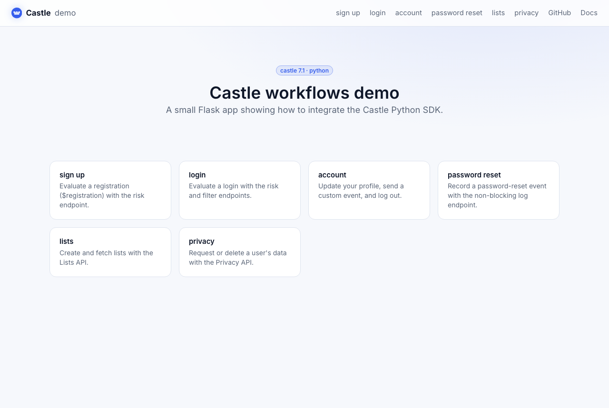
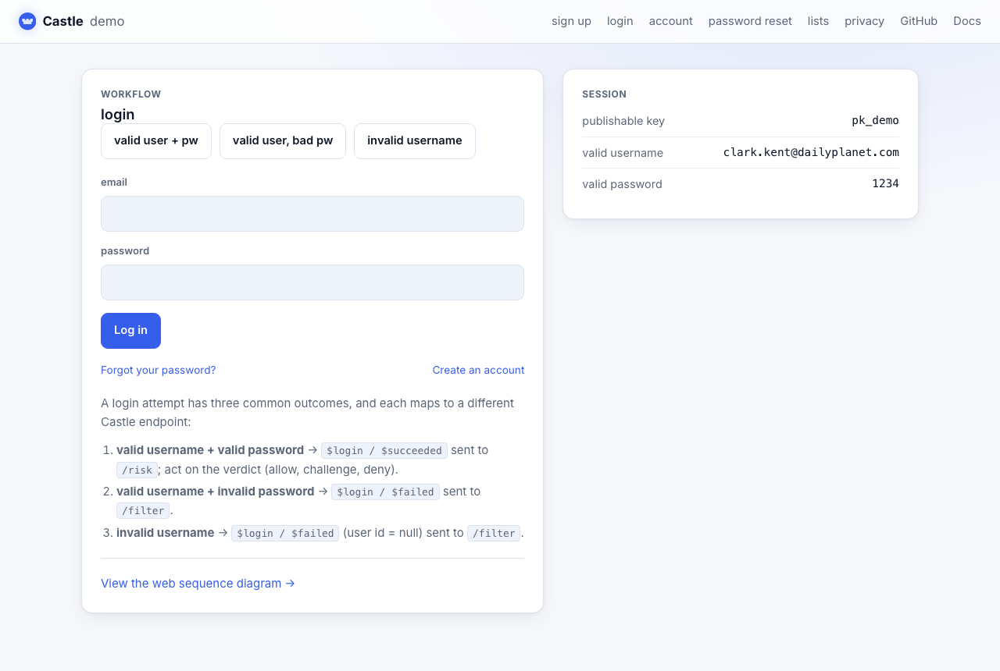

# Castle demo application: Python

This project demonstrates key Castle workflows in a Python / Flask app built on
the [castle](https://github.com/castle/castle-python) SDK (7.1).

## What's demonstrated

The app walks through a full user lifecycle. Every action mints a fresh Castle
request token in the browser (`Castle.createRequestToken()`) and forwards it to
the backend, which calls Castle and acts on the verdict.

- **sign up** – `$registration` to `risk` (a new email) or `filter` (an email that already exists)
- **login** – `$login` to `risk` (successful) or `filter` (failed)
- **account** – post-login actions: profile update (`$profile_update` to `risk`), a custom event (`Castle.custom()`), and logout (`$logout` via the non-blocking `log` endpoint)
- **password reset** – `$password_reset` via the non-blocking `log` endpoint
- **lists** – the Lists API (`create_list`, `get_all_lists`)
- **privacy** – the Privacy API (`request_user_data`, `delete_user_data`)
- **webhooks** – incoming Castle webhooks are signature-verified with `WebhooksVerify` (against the `X-Castle-Signature` header) and the most recent payloads are listed

## Screenshots

| Home | Login |
| ---- | ----- |
|  |  |

## Prerequisites

You'll need a Castle account. If you don't have one, start a free trial at
https://castle.io. For local development, use a **sandbox** environment so demo
traffic from `localhost` stays separate from production data — from the Castle
dashboard (Settings → API) grab the sandbox keys:

- your **publishable key** (`castle_pk`) – used by the browser SDK
- your **API secret** (`castle_api_secret`) – used by the backend SDK

These are the only two values you need to configure.

## Running locally

The castle 7.1 SDK requires **Python 3.9 or newer** (tested with Python 3.13).

```bash
git clone https://github.com/castle/castle-python-example.git
cd castle-python-example
```

Create and activate a virtual environment, then install dependencies:

```bash
python -m venv venv
. venv/bin/activate
pip install -r requirements.txt
```

The Castle browser SDK is served at runtime straight from `node_modules`, so
install it too:

```bash
npm install
```

Create your `.env` from the example and fill in your two Castle keys:

```bash
cp .env_example .env
```

Run the app:

```bash
flask --app app run --port 4007
# Running on http://127.0.0.1:4007
```

It also runs under gunicorn: `gunicorn app:app`.

## Running with Docker

The bundled `Dockerfile` builds from local source and serves the app with
gunicorn on port 80.

```bash
docker build -t castle-demo-python .

docker run -d -p 4005:80 \
  -e castle_pk=YOUR_PUBLISHABLE_KEY \
  -e castle_api_secret=YOUR_API_SECRET \
  castle-demo-python
```

The app will be available at http://127.0.0.1:4005. Point it at a Castle sandbox
environment when running locally.

## Disclaimer

We're sharing this sample app in the hope that other developers find it
valuable. Although it is not an officially supported sample, we welcome
questions and suggestions at `support@castle.io`.
